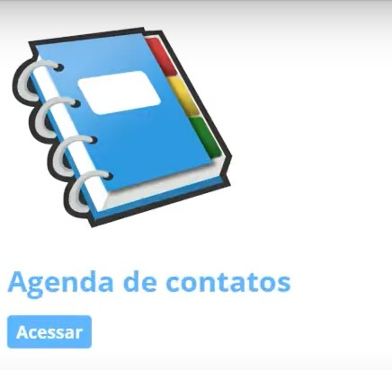
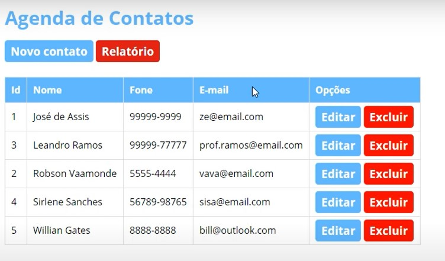
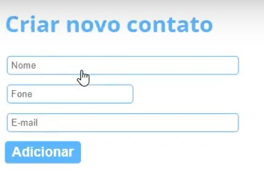
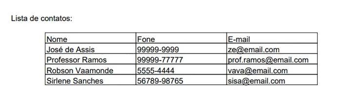

# Projeto Agenda de Contatos

## Objetivo

Desenvolver meus conhecimentos e habilidades relacionadas ao Java EE por meio dessa aplicação Java Web - Agenda de Contatos.

## Tecnologias utilizadas

- Servidor Tomcat;
- Java EE - Servlet & JSP;
- IDE Eclipse;
- MySQL Database;
- Estilo arquitetural MVC;
- JavaBeans;
- JDBC;
- iText;
- HTML, CSS e Javascript.

## Telas

### Home Page

---

### Gerenciar Contatos

---

### Criar Contato

---

### Relatório dos Contatos

## Créditos

Curso de JavaEE MySQL do professor José de Assis.

- [Playlist do curso](https://youtube.com/playlist?list=PLbEOwbQR9lqz9AnwhrrOLz9cz1-TxoiUg)
- [Canal no Youtube](https://www.youtube.com/c/RoboticapraticaBr)
